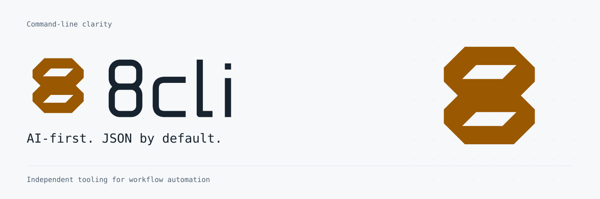

<picture>
  <source media="(prefers-color-scheme: dark)" srcset="assets/brand/banner-dark.svg">
  
</picture>

<h1 align="center">8cli – n8n from the command line</h1>

<div align="center">
  <strong>Manage n8n from your terminal – with JSON built for agents and scripts.</strong>
  <br><br>
  <a href="https://github.com/qodeca/8cli/actions/workflows/ci.yml"></a>
  <a href="https://www.npmjs.com/package/@qodeca/8cli"></a>
  <a href="LICENSE"></a>
  <a href="https://nodejs.org/en/download"></a>
</div>

<br>


## Why 8cli?

- **AI-first** – commands return JSON by default; errors are structured JSON on stderr, with no CLI prompts.
- **Composable** – pipe workflow and execution data through `jq` or other tools.
- **Secrets handled deliberately** – macOS Keychain support; environment variables on other platforms. No secrets in config files.
- **Automation-friendly** – inspect workflows, executions, credentials and more from scripts or coding agents.

8cli requires **Node.js 22.22+** and an n8n instance with API access. macOS can store API keys in Keychain; Windows and Linux currently use environment variables.

## Install

```bash
npm install -g @qodeca/8cli
```

The package is also available on [npm](https://www.npmjs.com/package/@qodeca/8cli). For a step-by-step first run, see [Getting started](docs/getting-started.md). To work on 8cli itself, see [`CONTRIBUTING.md`](./CONTRIBUTING.md).

## 60-second quick start

Create an API key in your n8n instance. In your terminal, paste it after running this command and press Enter. The hidden input keeps it out of shell history:

```bash
read -rs N8N_API_KEY
```

Then export it and point 8cli at your instance:

```bash
export N8N_API_KEY
export N8N_URL=https://your-n8n.example.com
8cli auth verify
8cli wf list
8cli wf list | jq '.[] | {id, name, active}'
```

`wf list` returns a JSON array, including `[]` when no workflows exist. Install [`jq`](https://jqlang.github.io/jq/) for the last command.

### macOS: store the key in Keychain

Optionally, save the key from the environment into Keychain, then remove it from the environment:

```bash
printf '%s' "$N8N_API_KEY" | 8cli auth set-api-key --value -
unset N8N_API_KEY
```

The key is stored per instance URL, so 8cli finds it only while `N8N_URL`, `--url` or `url` in `8cli.json` names that same instance. See [Configuration](docs/configuration.md) for the full lookup order and its `ERR_CONFIG_SOURCE_MISMATCH` refusal when config-file URLs are paired with environment or flag credentials.

## Command overview

| Command (alias)         | Use it for                            | Reference                                          |
| ----------------------- | ------------------------------------- | -------------------------------------------------- |
| `auth`                  | Set credentials and verify access     | [Auth](docs/reference/auth.md)                     |
| `config`                | Inspect resolved configuration        | [Config](docs/reference/config.md)                 |
| `workflow` (`wf`)       | List, inspect and manage workflows    | [Workflow](docs/reference/workflow.md)             |
| `execution` (`exec`)    | Inspect and delete executions         | [Execution](docs/reference/execution.md)           |
| `credential` (`cred`)   | List and manage credentials           | [Credential](docs/reference/credential.md)         |
| `tag`                   | Manage tags                           | [Tag](docs/reference/tag.md)                       |
| `variable` (`var`)      | Manage variables                      | [Variable](docs/reference/variable.md)             |
| `project` (`proj`)      | Manage projects                       | [Project](docs/reference/project.md)               |
| `user`                  | Inspect users                         | [User](docs/reference/user.md)                     |
| `folder`                | Manage folders                        | [Folder](docs/reference/folder.md)                 |
| `datatable` (`dt`)      | Manage data tables and rows           | [Data table](docs/reference/datatable.md)          |
| `audit`                 | Run instance audits                   | [Audit](docs/reference/audit.md)                   |
| `source-control` (`sc`) | Inspect and pull source control state | [Source control](docs/reference/source-control.md) |

Run `8cli <command> --help` for flags and subcommands. Some groups require n8n Enterprise features or additional credentials; see [Community vs. Enterprise](docs/community-vs-enterprise.md). `sc push` returns `ERR_NOT_SUPPORTED` because n8n's public API has no push endpoint.

For output formats and error codes, see [Output and errors](docs/output-and-errors.md). For guides, recipes and the full reference, start at the [documentation index](docs/README.md).

## Disclaimer

8cli is an independent, third-party tool. It is **not** affiliated with, endorsed by, or
sponsored by n8n GmbH. "n8n" is a trademark of n8n GmbH, used here only to describe
compatibility.

"Claude" and "Claude Code" are trademarks of Anthropic; 8cli is not affiliated with or
endorsed by Anthropic – it is simply designed to be usable by terminal coding agents. See
[`TRADEMARKS.md`](./TRADEMARKS.md) for the full trademark policy, including Qodeca's own marks.

## Support

See [`SUPPORT.md`](./SUPPORT.md) for where to get help: usage questions go to
[GitHub Discussions](https://github.com/qodeca/8cli/discussions), bugs and feature requests to
[issues](https://github.com/qodeca/8cli/issues). Report security issues privately (see
[Security](#security)).

## Contributing

Contributions are welcome – see [`CONTRIBUTING.md`](./CONTRIBUTING.md) for setup and the
quality gates, and [`CODE_OF_CONDUCT.md`](./CODE_OF_CONDUCT.md) for community standards.
Contributions are accepted under **GPL-3.0-only** and require agreeing to the project
[Contributor License Agreement](./CLA.md) – by opening a pull request you agree to its
terms (your Git author identity is your record).

## Security

8cli stores secrets in the macOS Keychain or reads them from environment variables – never from
config files – and refuses plaintext-HTTP URLs by default. Report security vulnerabilities **privately** via
[GitHub's private advisory reporting](https://github.com/qodeca/8cli/security/advisories/new) –
see [`SECURITY.md`](./SECURITY.md). Please do not open a public issue for an unfixed vulnerability.

## License

8cli is licensed under the **GNU General Public License v3.0 only** – see
[`LICENSE`](./LICENSE) for the full text. The corresponding source is available at
<https://github.com/qodeca/8cli>. Bundled third-party dependencies and their notices are
listed in [`THIRD-PARTY-LICENSES.md`](./THIRD-PARTY-LICENSES.md); development-only
dependencies are not distributed.

This project was extracted from an internal Qodeca monorepo; prior commit history is not
preserved in this repository.

## Built by Qodeca

8cli is built by **[Qodeca](https://qodeca.com)** – a Warsaw-based software team building
software since 2014 for the fitness, sport, and healthcare industries, where HIPAA, GDPR, and
PCI DSS are the baseline, not the exception. We build a lot of our tooling in the open.

**Related projects:** [erfana](https://github.com/qodeca/erfana) (agent-native Markdown
workspace) · [erfana-skills](https://github.com/qodeca/erfana-skills) (Claude Code plugin).

[qodeca.com](https://qodeca.com) · [LinkedIn](https://www.linkedin.com/company/qodecasoftwaredevelopment) · [hi@qodeca.com](mailto:hi@qodeca.com)
