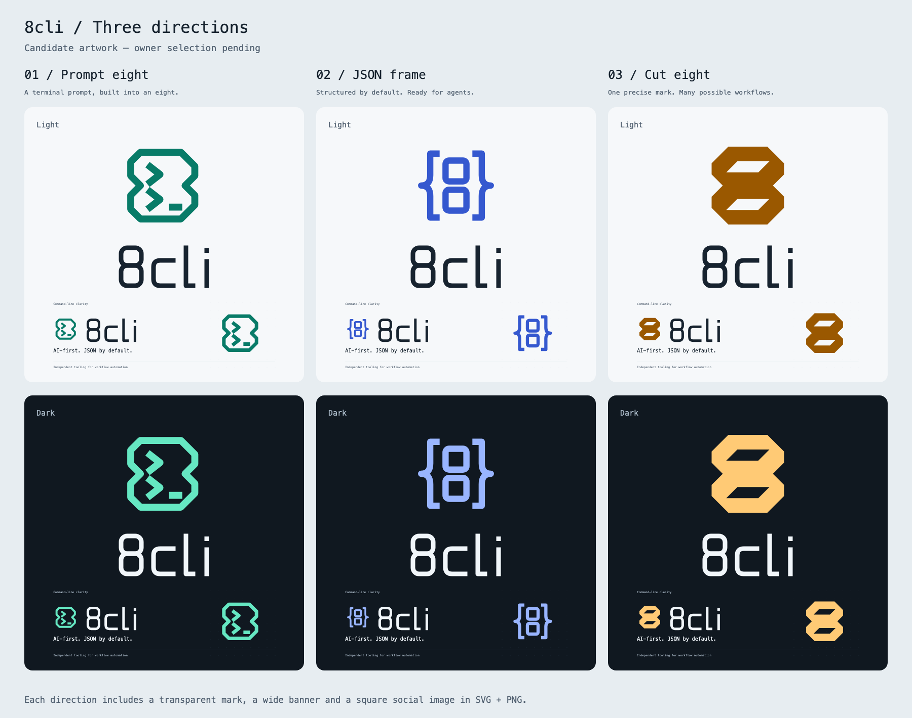

# 8cli brand candidates

Three unselected directions for [issue #37](https://github.com/qodeca/8cli/issues/37).
These are proposals, not an approved identity. The owner chooses before adoption or merge.



| Direction                     | Rationale                                                                                             |
| ----------------------------- | ----------------------------------------------------------------------------------------------------- |
| [Prompt eight](prompt-eight/) | A double terminal prompt sits inside an eight-shaped outline, making the command line the identity.   |
| [JSON frame](json-frame/)     | Curly braces enclose a modular eight, putting structured output at the center.                        |
| [Cut eight](cut-eight/)       | Two diagonal counters cut a compact, solid eight, giving the tool a distinctive stamp at small sizes. |

Read the sheet as three equally available options, each usable in light and dark contexts.

## Files

Each direction contains SVG source and PNG previews for:

- `logo-light` and `logo-dark` – transparent 512 × 512 marks, colored for the named background theme.
- `banner-light` and `banner-dark` – opaque 1440 × 480 README heroes.
- `social-light` and `social-dark` – opaque 800 × 800 square social artwork.

`preview-sheet.svg` and `preview-sheet.png` compare the three directions side by side,
with light above dark. The sheet is 1800 × 1420. PNGs use the SVG's native dimensions.
All brand-name lettering and logo geometry are paths; supporting copy uses Menlo with
Consolas and monospace fallbacks. Font metrics may vary on other machines.

## Provenance

Original AI-authored vector artwork by OpenAI Codex, created directly as SVG through
`generate.py`; no image model, stock art, downloaded graphics, or third-party logo paths
were used. The exact backend model revision is unavailable. This is invented brand
artwork, not a diagram or a chart of verified measurements.

Authoring instruction: “Draw three distinct logo directions for 8cli, an AI-first,
JSON-by-default command-line tool. Explore a terminal prompt integrated into an eight,
JSON braces framing an eight, and a solid geometric eight with diagonal cuts. Give each
an independent palette, light and dark variants, a wide README banner and a square
social image. Use no n8n trademark, node-network symbol or endorsement claim. Keep all
three unselected.”

The task assignment and `gh issue view 37 --repo qodeca/8cli` supplied the brief.
`CLAUDE.md` and the root README supplied product positioning. The configured design-system
path, `docs/design-system`, did not exist, and there were no prior assets or GUI screens.
The shared monospace copy and restrained layout follow the existing CLI and README code
examples. Teal, blue and amber palettes and the bespoke wordmark are new proposals,
not existing design tokens. No n8n artwork or trademark appears in the images; all three
avoid its connected-node motif. This is a visual self-check, not legal trademark clearance.

The installed `xezar-visual-asset` skill had no declared version; its SHA-256 was
`53a499277b199cf111c736245acc65da82f129e194a9ce4d3d87ed3071a7ca49`.
Artwork and scripts use the repository's GPL-3.0-only licensing and Qodeca attribution.

## Regeneration

Run from the repository root with Python 3 and an already installed Google Chrome:

```sh
python3 assets/brand/candidates/generate.py
python3 assets/brand/candidates/render.py '/Applications/Google Chrome.app/Contents/MacOS/Google Chrome'
```

The renderer takes the Chrome executable path as its only argument, never installs a
renderer, and keeps temporary profiles under `.local/xezar/scratch/brand/`.
The supplied PNGs were rendered with Google Chrome 153.0.8010.53 on macOS.
Edit `generate.py` for geometry, palette or layout changes, then regenerate both formats.
No application build step or dependency is added.

## Selection and delivery

A later workflow handoff opens a draft PR against `develop`, embeds the preview sheet,
lists the three rationales, says `Refs #37`, and applies `do-not-merge`. Owner approval
must be recorded on #37 before merge. The root README and `docs/` are intentionally
outside this task's file ownership; adopting the selected direction and wiring the
README are subsequent work. This candidate set does not close #37.
